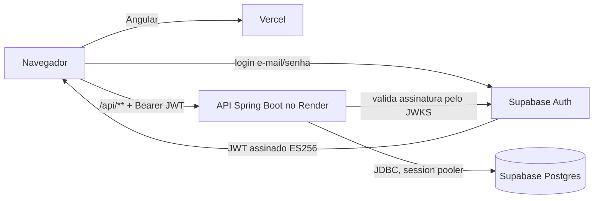

# POrganization

[](https://github.com/pedrinzz10/POrganization/actions/workflows/backend.yml)
[](https://github.com/pedrinzz10/POrganization/actions/workflows/frontend.yml)
[](https://github.com/pedrinzz10/POrganization/actions/workflows/secrets.yml)

Organizador pessoal que reúne **compromissos**, **estudos** e **finanças** em um só app, com uma tela **Hoje** que mostra o que fazer, o que revisar e o que pagar no dia.

## Funcionalidades

| Área | O que faz | Etapa |
|---|---|---|
| Base | Login com Supabase, layout responsivo, CI e deploy | 1 ✅ |
| Compromissos | Criação rápida (título, dia e hora), recorrência, visões de dia, semana, mês e ano | 2 |
| Estudos | Matérias com tags e prioridade, timer, revisões em mini aulas agendadas por repetição espaçada (FSRS) | 3 |
| Finanças | Contas, transações, cartão com fatura e parcelas, fixos, orçamentos com alerta, metas e dashboard | 4 |
| Integrações | Lembretes por e-mail e push, resumo diário e Google Calendar nos dois sentidos | 5 |

## Arquitetura



O frontend faz login direto no Supabase Auth e manda o token para a API. A API valida o token pelo JWKS do Supabase e acessa o Postgres. Todas as tabelas têm RLS ativo sem policies, então a API REST automática do Supabase não expõe nenhum dado. Detalhes, decisões e o fluxo de uma requisição estão em [`docs/arquitetura.md`](docs/arquitetura.md).

| Camada | Tecnologia |
|---|---|
| Backend | Java 21, Spring Boot 4 (Web MVC, Security OAuth2 Resource Server, Data JPA, Flyway, Actuator) |
| Frontend | Angular 22 (standalone, zoneless, signals), Angular Material |
| Banco e auth | Supabase (Postgres 17 e Supabase Auth) |
| Deploy | Render (API em Docker), Vercel (frontend) |
| Testes | JUnit 5, Testcontainers, MockMvc, Vitest, Playwright |

## Estrutura

```
backend/     API Spring Boot (com.porganization.*)
frontend/    app Angular (src/app/{core,shared,layout,features})
docs/        arquitetura e decisões
scripts/     verificações do repositório (estrutura, segredos, CI, deploy)
.githooks/   hook pre-commit contra segredos
specs.json   as specs do plano, geradas a partir do PLANO_IMPLEMENTACAO.md
```

## Rodando localmente

**Pré-requisitos:** JDK 21, Node ≥ 24.15, Docker em execução e Git. No Windows, rode os comandos no Git Bash.

```bash
# 1. Clonar e preparar (ativa o hook de segredos e cria o .env a partir do .env.example)
git clone https://github.com/pedrinzz10/POrganization.git
cd POrganization
bash scripts/setup-dev.sh

# 2. API em http://localhost:8080, com um Postgres descartável no Docker (não precisa do Supabase)
cd backend
./mvnw spring-boot:test-run

# 3. Em outro terminal: frontend em http://localhost:4200
cd frontend
npm ci
npm start
```

Confira com `curl http://localhost:8080/api/health` → `{"status":"UP"}` e abra http://localhost:4200.

Sem o Supabase configurado, o app abre na tela de login, mas não consegue entrar. Para usar de verdade:

1. **Backend:** preencha o `.env` da raiz (veja [Variáveis de ambiente](#variáveis-de-ambiente)) e rode com o perfil `dev`, que usa o seu Postgres do Supabase:
   ```bash
   cd backend && ./mvnw spring-boot:run -Dspring-boot.run.profiles=dev
   ```
2. **Frontend:** coloque a `supabaseUrl` e a `supabaseKey` do seu projeto em `frontend/src/environments/environment.development.ts`.

## Testes

| Comando | O que roda |
|---|---|
| `cd backend && ./mvnw verify` | unitários e de integração (Postgres real via Testcontainers; precisa do Docker) |
| `cd frontend && npm test -- --watch=false` | unitários e de componente (Vitest) |
| `cd frontend && npm run e2e` | e2e com Playwright; sobe o `ng serve` sozinho e simula a sessão, sem Supabase |
| `bash scripts/smoke-docker.sh` | a imagem Docker da API sobe com o perfil `prod` |
| `bash scripts/check-secrets.sh` | nenhum segredo nos arquivos rastreados |
| `bash scripts/check-env-docs.sh` | toda variável usada no código está documentada aqui e no `.env.example` |

O CI roda os workflows `backend`, `frontend` e `segredos` em todo PR, e os três são obrigatórios para o merge na `main`.

## Variáveis de ambiente

O backend lê variáveis de ambiente. Localmente, o perfil `dev` as carrega do `.env` na raiz, que não vai para o git; em produção elas ficam no painel do Render. O modelo está no [`.env.example`](.env.example).

| Variável | Segredo? | Descrição |
|---|---|---|
| `DB_URL` | não | JDBC do **session pooler** do Supabase (porta 5432): `jdbc:postgresql://aws-0-<regiao>.pooler.supabase.com:5432/postgres?sslmode=require` |
| `DB_USER` | não | `postgres.<ref-do-projeto>` |
| `DB_PASSWORD` | **sim** | senha do banco do Supabase |
| `SUPABASE_JWKS_URI` | não | `https://<ref>.supabase.co/auth/v1/.well-known/jwks.json` (exige as JWT Signing Keys assimétricas ativas) |
| `SUPABASE_ISSUER` | não | `https://<ref>.supabase.co/auth/v1` |
| `FRONTEND_ORIGIN` | não | origem liberada no CORS; padrão `http://localhost:4200`, várias separadas por vírgula |
| `PORT` | não | porta HTTP; o Render define, localmente é `8080` |
| `SPRING_PROFILES_ACTIVE` | não | `dev` (local com Supabase) ou `prod` (Render); sem perfil, só os testes funcionam |

O frontend não tem segredos. Os valores ficam em `frontend/src/environments/`:

| Campo | Descrição |
|---|---|
| `apiUrl` | URL da API com `/api` no fim (`http://localhost:8080/api` local) |
| `supabaseUrl` | URL do projeto Supabase |
| `supabaseKey` | **publishable key** (`sb_publishable_...`), pública por design; nunca a secret key |

As regras sobre segredos e o que fazer se algum vazar estão em [`SECURITY.md`](SECURITY.md).

## Deploy

1. **Supabase**
   - Em *Project Settings → JWT Keys*, ative as **JWT Signing Keys** (ES256).
   - Em *Connect → Session pooler*, anote host e usuário.
   - Em *API Keys*, copie a publishable key.
2. **Render (API)**
   - *New → Blueprint* → este repositório. O [`render.yaml`](render.yaml) cria o serviço `porganization-api` com Docker.
   - Preencha `DB_URL`, `DB_USER`, `DB_PASSWORD`, `SUPABASE_JWKS_URI`, `SUPABASE_ISSUER` e `FRONTEND_ORIGIN`.
   - No primeiro deploy, o Flyway cria as tabelas no Supabase.
3. **Vercel (frontend)**
   - *New Project* → este repositório, com **Root Directory = `frontend`**. O [`vercel.json`](frontend/vercel.json) define o build e o rewrite de SPA.
4. **Endereços de produção:** coloque as URLs reais em `frontend/src/environments/environment.ts`, num PR.
5. **Smoke test contra o deploy:**
   ```bash
   cd frontend
   PROD_BASE_URL=https://<app>.vercel.app PROD_API_URL=https://porganization-api.onrender.com/api \
   E2E_USER_EMAIL=<usuario-de-teste> E2E_USER_PASSWORD=<senha> npm run e2e:prod
   ```

O plano gratuito do Render hiberna a API depois de um tempo sem acesso, e a primeira chamada seguinte leva cerca de 1 minuto.

## Como o projeto é desenvolvido

O trabalho é dividido em 58 specs no [`PLANO_IMPLEMENTACAO.md`](PLANO_IMPLEMENTACAO.md), consolidadas no [`specs.json`](specs.json). Cada spec tem critérios de aceite e os testes que os provam:

1. Status `em_andamento` e uma branch `spec/<ID>-<assunto>`.
2. Testes dos critérios escritos primeiro e vistos falhando.
3. Implementação até passarem, e `./mvnw verify` / `npm test`.
4. Status `em_revisao` e PR para a `main`. O CI precisa ficar verde.
5. Depois do merge, status `concluida`.

Depois de editar uma spec no plano, rode `python scripts/build_specs.py`. O esquema completo está em [`specs/README.md`](specs/README.md).
