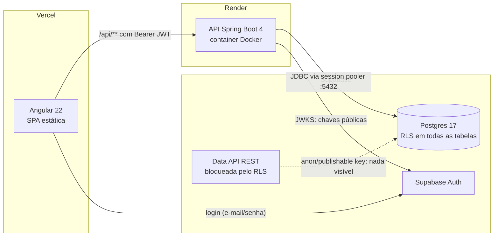
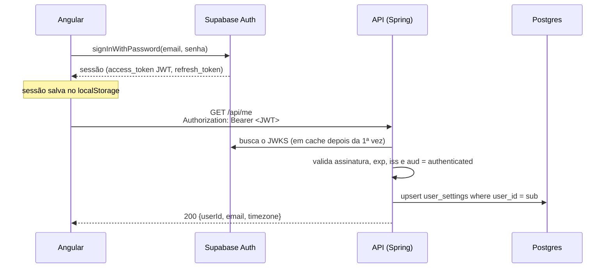

# Arquitetura

## Visão geral

| Parte | Onde roda | Responsabilidade |
|---|---|---|
| Frontend | Vercel (arquivos estáticos) | telas, login direto no Supabase Auth, chamadas à API com o token |
| API | Render (Docker, plano gratuito) | regras de negócio, validação do token, acesso ao banco |
| Banco e auth | Supabase | Postgres gerenciado e emissão dos JWT dos usuários |

## Uma requisição autenticada

- **Frontend:**
  - O `authInterceptor` pede o token ao Supabase a cada chamada, e o Supabase renova se ele já venceu.
  - O token só vai para a `apiUrl`.
  - Um 401 da API encerra a sessão.
- **Backend:**
  - O `JwtDecoder` do Spring Boot valida a assinatura (ES256/RS256), a expiração, o `iss` do projeto e o `aud = authenticated`.
  - O `@CurrentUser UUID userId` injeta o `sub` nos controllers.

## Decisões

| Decisão | Por quê |
|---|---|
| API valida o JWT pelo **JWKS** (chaves assimétricas) | a API não guarda nenhum segredo do Supabase; nem a secret key nem a service_role são usadas |
| **RLS ativo sem policies** em toda tabela (`RowLevelSecurityTest`) | o schema `public` do Supabase é exposto por uma API REST acessível com a chave pública do frontend; o RLS a bloqueia. A API conecta como `postgres`, dono das tabelas, e não é afetada |
| **Multiusuário por `user_id`** em toda tabela; registro de outro usuário responde **404** | cada consulta filtra pelo usuário do token; 404, e não 403, para não revelar que o id existe |
| **Session pooler (5432)**, não conexão direta nem transaction pooler | a conexão direta é só IPv6 e o Render não tem IPv6; o modo transaction (6543) quebra prepared statements do JDBC e o lock do Flyway |
| **Flyway** com `ddl-auto=validate` | o esquema é versionado; o Hibernate só confere e falha na subida se entidade e tabela divergirem |
| Erros como **`ProblemDetail`** (RFC 9457), em português | um formato só para o frontend; 500 nunca expõe mensagem interna |
| Dinheiro em `BigDecimal` / `NUMERIC(14,2)`, trafegando como string | sem erro de ponto flutuante em centavos |
| **Lembretes por cron externo** chamando um endpoint protegido (etapa 5) | o Render gratuito hiberna a API; um `@Scheduled` interno não dispararia |
| Angular **zoneless** com signals | padrão do Angular 22; o estado (ex.: sessão) é signal e as telas reagem sozinhas |

## Backend

Pacotes em `com.porganization`:

| Pacote | Conteúdo |
|---|---|
| `security` | `SecurityConfig` (resource server, CORS), `@CurrentUser`, `GET /api/me` |
| `common` | `GlobalExceptionHandler`, `NotFoundException`, health check |
| `config` | configurações transversais (locale pt-BR) |
| `settings` | preferências do usuário (`user_settings`) |
| `commitments`, `studies`, `finance`, `notifications`, `integrations`, `today` | um por área do produto, criados nas etapas 2 a 5 |

Os testes de integração herdam de `support.IntegrationTest`, que tem contexto completo, MockMvc, Postgres do Testcontainers e o `TestJwks`. O `TestJwks` faz o papel do Supabase Auth: publica um JWKS local e assina tokens reais.

## Frontend

| Pasta | Conteúdo |
|---|---|
| `core/` | `AuthService`, guard, interceptor, cliente do Supabase, locale pt-BR |
| `layout/` | `ShellComponent` (barra + menu lateral responsivo) |
| `shared/` | componentes reutilizáveis |
| `features/` | uma pasta por área (`auth`, `today`, `commitments`, `studies`, `finance`, `settings`), sempre com `loadComponent` |

Os e2e (`frontend/e2e`) simulam a sessão no `localStorage` e bloqueiam a rede para o Supabase, então rodam sem credenciais.

## Segurança do repositório

O repositório é público. O `.gitignore`, o hook pre-commit (`check-secrets` + gitleaks), o CI `segredos`, o push protection do GitHub e o ruleset da `main` impedem que segredos entrem. Veja [`SECURITY.md`](../SECURITY.md).
